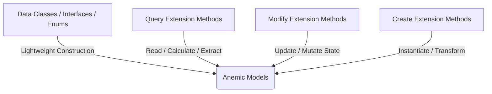

# DiGi.Weather

**DiGi.Weather** is the weather data library of the DiGi software ecosystem. It provides lightweight, serializable domain models for hourly meteorological data — an indexed [Weather](DiGi.Weather/Classes/Weather.cs) container and per-hour [WeatherRecord](DiGi.Weather/Classes/WeatherRecord.cs) measurements — designed to be consumed by the simulation, solar, and analytical libraries across the Revit, Rhino, Grasshopper, and Dynamo integrations.

The library targets **.NET Standard 2.0** and builds directly on [DiGi.Core](https://github.com/ZiolkowskiJakub/DiGi.Core)'s `SerializableObject` pattern, so every model supports reflection-driven JSON persistence, cloning, and polymorphic deserialization out of the box.

---

## 🏗️ Library Overview

The assembly is organized into the two data layers of the DiGi.Core pattern — anemic model classes and their marker interfaces.

### Classes ([DiGi.Weather.Classes](DiGi.Weather/Classes))
* **[WeatherRecord.cs](DiGi.Weather/Classes/WeatherRecord.cs):** A single hourly record holding the standard meteorological measurements (dry bulb / dew point temperature, relative humidity, atmospheric station pressure, direct / diffuse / global radiation and illuminance, wind direction and speed, sky cover, ceiling height, snow depth, and more). Each measurement is exposed as a read-only property carrying its physical unit in the documentation, keyed by its `DateTime`.
* **[Weather.cs](DiGi.Weather/Classes/Weather.cs):** A container of weather records.
  * `Weather<TWeatherRecord>` — the generic base container. It indexes records by `DateTime` in a dictionary (deduplicating on timestamp) and implements `IEnumerable<TWeatherRecord>` for direct iteration over the stored records.
  * `Weather` — the concrete `Weather<WeatherRecord>` specialization used by consumers.

### Interfaces ([DiGi.Weather.Interfaces](DiGi.Weather/Interfaces))
* **[IWeatherObject.cs](DiGi.Weather/Interfaces/IWeatherObject.cs):** The base marker interface for all weather objects (`: DiGi.Core.Interfaces.IObject`).
* **[IWeatherSerializableObject.cs](DiGi.Weather/Interfaces/IWeatherSerializableObject.cs):** The serializable marker interface (`: IWeatherObject, DiGi.Core.Interfaces.ISerializableObject`). Every serializable model in the project implements this.
* **[IWeatherRecord.cs](DiGi.Weather/Interfaces/IWeatherRecord.cs):** Contract for a weather record, exposing the `DateTime` used as the container key.

---

## 🎨 The DiGi.Core Architectural Pattern

DiGi.Weather follows the ecosystem-wide separation of concerns: **data models** (anemic schemas) are kept distinct from **business logic** (static extension methods). All new features must follow this pattern.

### 1. Data Models (Classes, Interfaces, Enums)
* **Directory Structure:** Located under `/Classes` (Namespace: `DiGi.Weather.Classes`), `/Interfaces` (Namespace: `DiGi.Weather.Interfaces`), or `/Enums` (Namespace: `DiGi.Weather.Enums`).
* **Scope:** Lightweight properties and basic constructors only. **No complex business logic** is allowed inside the model classes themselves.

### 2. Business Logic (Extension Methods)
All operations, calculations, and conversions are implemented as static **Extension Methods** grouped into static partial classes — never a new manager/service class:
* **Query** (`/Query` → `public static partial class Query`): Returns values or calculations based on the object state without mutating it (e.g., averaging a temperature series, extracting a design day).
* **Modify** (`/Modify` → `public static partial class Modify`): Modifies the state or properties of the target object.
* **Create** (`/Create` → `public static partial class Create`): Instantiates and returns a brand-new object (e.g., building a `Weather` container from a parsed weather file).

---

## 🧬 Serialization Pattern

Every model under `/Classes` inherits `DiGi.Core.Classes.SerializableObject` and implements `IWeatherSerializableObject`, following the reflection-driven shape used across the ecosystem:

1. **Backing fields** are `private readonly`, each tagged `[JsonInclude, JsonPropertyName(nameof(PublicProperty))]` — always via `nameof(...)`, never a string literal.
2. **Three constructors, in this order:** the primary constructor (assigns fields), a **copy constructor** `ClassName(ClassName? instance) : base(instance)` copying every field (cloning nested `SerializableObject` items via `Core.Query.Clone(...)`), and a **JSON constructor** `ClassName(JsonObject? jsonObject) : base(jsonObject)` with an empty body.
3. **Public properties** are `[JsonIgnore]`, get-only, returning the backing field — the field attribute already handles serialization.

See [WeatherRecord.cs](DiGi.Weather/Classes/WeatherRecord.cs) for a complete reference implementation.

---

## 💻 Coding Guidelines

All code (including tests) must comply with the shared DiGi coding standards enforced across the ecosystem:

* **English only** for identifiers and comments.
* **No `var`** — explicit types everywhere the compiler allows.
* Use **target-typed `new(...)`** when the target type is already declared (avoids IDE0090) and **collection expressions `[]`** instead of `new List<T>()` / `new T[] {...}` (avoids IDE0028).
* **Zero warnings / analyzer messages** — strict nullability, parameter validation, clean code. Assume `LangVersion` 10+.
* **Variable naming:** start with the type name in camelCase, appending a descriptive suffix after `_` when needed (`WeatherRecord weatherRecord_Base`). Collections use the pluralized element-type name, not the collection type (`weatherRecords`, not `listRecords`). Primitive/simple types may use plain camelCase.

---

## 📚 API Reference & Wiki

* **Generated API docs:** Split per namespace under [`documentation/API/DiGi.Weather/`](documentation/API/DiGi.Weather). These files contain exact signatures and `
` descriptions for all public classes, constructors, methods, and properties, and are regenerated on every build.
* **Wiki:** The [DiGi.Weather Wiki](https://github.com/ZiolkowskiJakub/DiGi.Weather/wiki) mirrors the generated API documentation and is kept in sync automatically on push to `main`.

---

## 🌐 DiGi Ecosystem
* **Foundational:** [DiGi.Core](https://github.com/ZiolkowskiJakub/DiGi.Core) | [DiGi.Math](https://github.com/ZiolkowskiJakub/DiGi.Math) | [DiGi.Unit](https://github.com/ZiolkowskiJakub/DiGi.Unit) | [DiGi.Log](https://github.com/ZiolkowskiJakub/DiGi.Log)
* **Geometry & Graphics:** [DiGi.Geometry](https://github.com/ZiolkowskiJakub/DiGi.Geometry) | [DiGi.GLTF](https://github.com/ZiolkowskiJakub/DiGi.GLTF) | [DiGi.Rhino](https://github.com/ZiolkowskiJakub/DiGi.Rhino)
* **GIS & Data:** [DiGi.GIS](https://github.com/ZiolkowskiJakub/DiGi.GIS) | [DiGi.OSM](https://github.com/ZiolkowskiJakub/DiGi.OSM) | [DiGi.BDOT10k](https://github.com/ZiolkowskiJakub/DiGi.BDOT10k)
* **Simulation:** [DiGi.Analytical](https://github.com/ZiolkowskiJakub/DiGi.Analytical) | [DiGi.Solar](https://github.com/ZiolkowskiJakub/DiGi.Solar) | [DiGi.Tas](https://github.com/ZiolkowskiJakub/DiGi.Tas)

*Part of the DiGi software suite for BIM and CAD integrations.*
